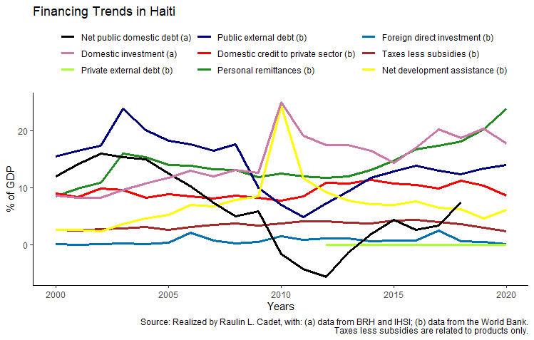
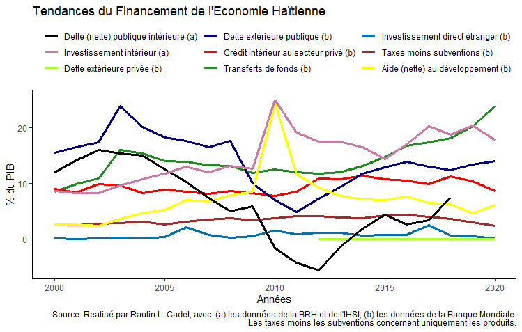

# Financing Trends in Haiti

This project use data provided by the World Bank in the tables of World Development Indicators (WDI), to realized two graphics, one with texts in English and a similar one with texts in French, to visualize the Haitian economy's financing trends.

The same graphics, with texts in French.

### Packages used
Three packages have been used. However, since they all are included in [tidyverse](https://www.tidyverse.org/), this last package have been loaded to use the three mentioned below.

* [readxl](https://readxl.tidyverse.org/)
* [dplyr](https://dplyr.tidyverse.org/)
* [ggplot2](https://ggplot2.tidyverse.org/)

### Steps
* Data from the WDI are saved in a file (xls format);
* Data have been imported to an R object, a data frame;
* Data wrangling is realized to:
  - structure the dataset to have one variable by column, 
  - convert the values of the variables to numeric data, since they have been imported as characters,
  - filter data to consider only the last 20 years where data is available.
* Realized the graphics, using the package [ggplot2](https://ggplot2.tidyverse.org/).

